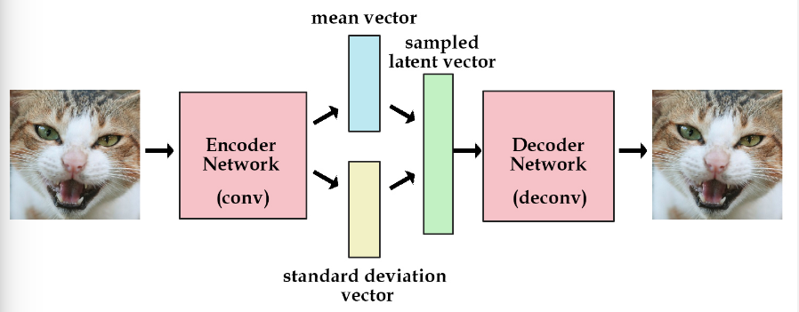
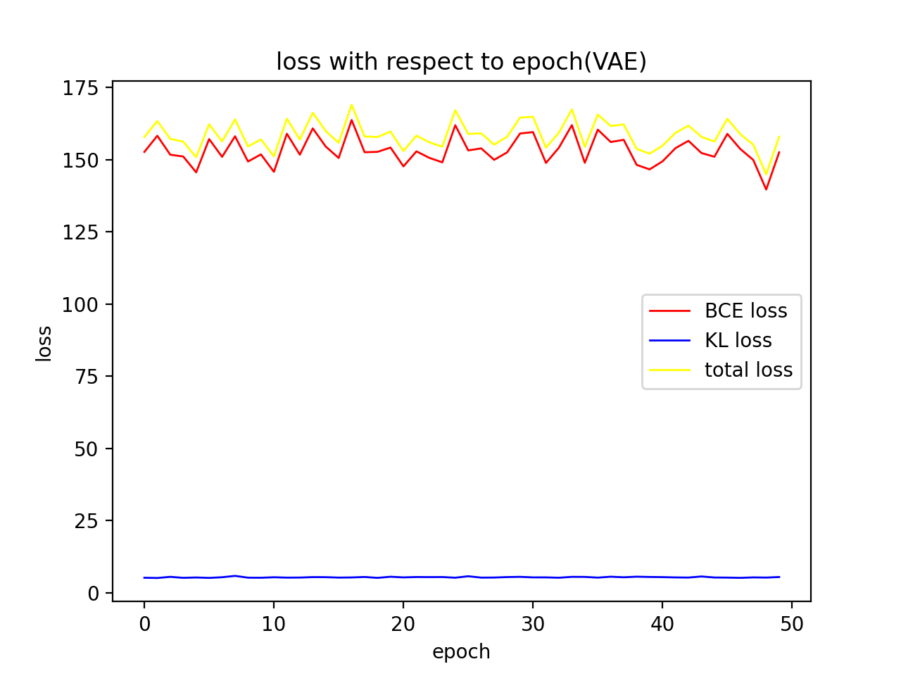
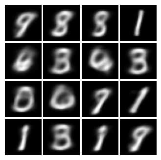
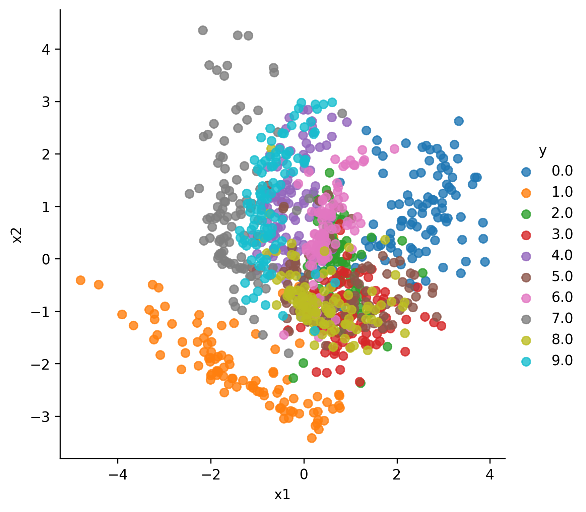
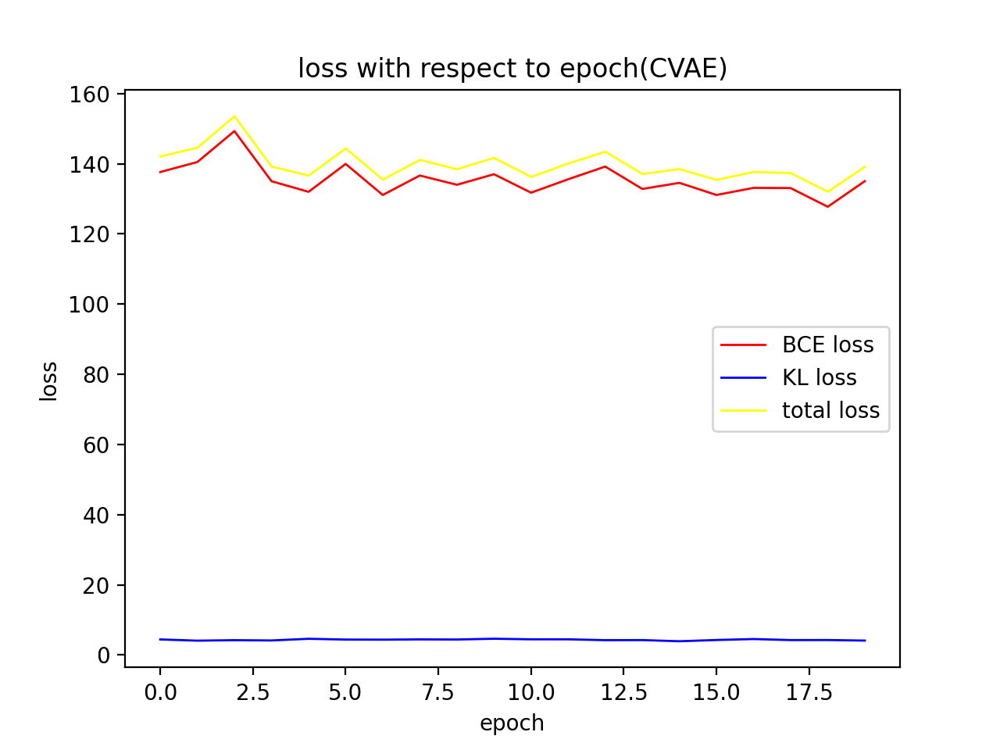
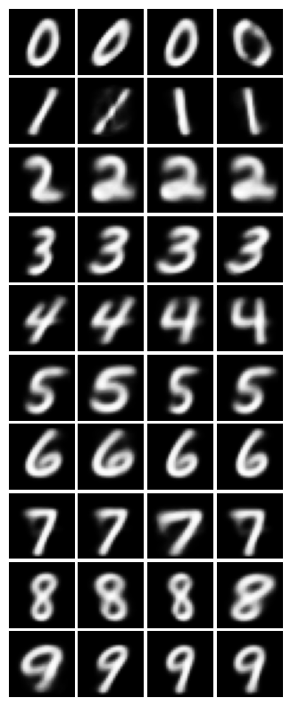
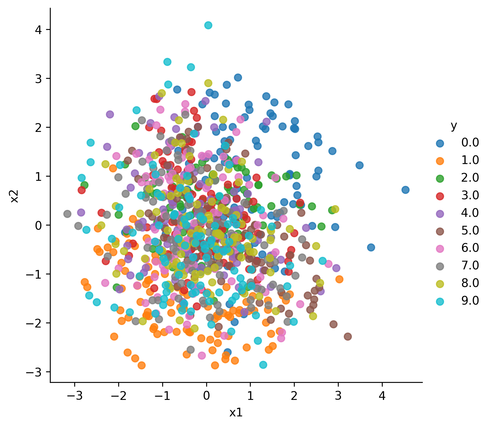

# VAE-pytorch
Pytorch implementation of VAE and CVAE

## VAE
In order to generate something, for instance, in our case the mnist digits, we need to find the real world distribution of mnist $P(X)$. If found, then what we need to do is sample from $P(X)$ and all is done. However, we are unable to get $P(X)$, so VAE figures out to use a latent variable to approximate $P(X)$.
$$
P(X) = \int P(x|z)P(z)
$$
Then all we need to do is to sample from z, and use $P(x|z)$ to generate x.

In order to train this $P(x|z)$ and find a suitable Z, we would define $P(z|x)$.
$$
P(Z) = \int P(z|x)P(x)
$$
Moreover, in order to do the sampling, VAE put some contraints on $P(z|x)$ and force to be a normal distribution $N(0, 1)$. Then we have
$$
P(Z) = \int P(z|x)P(x) = N(0, 1) \int P(x) = N(0, 1)
$$
By putting this constraint we confine P(Z) to be a normal distribution and thus, by sampling from a normal distribution, we can generate images of mnist. Moreover, this contsraint helps prevent overfitting and degenerate to AutoEncoder.

In VAE, both $P(z|x)$, $P(x|z)$ is approaximated using neural network. In training, we use a sample from mnist, obtain its corresponding latent variable via sampling according to $P(z|x)$, then get its generated image $x'$ through $P(x|z)$. We compute loss between groudtruth and generated to train $P(x|z)$. In order to perform the constraint, we add another loss term via KL-Divergence between the $P(x|z)$ and $N(0,1)$ to force $P(x|z)$ into a $N(0,1)$.

In implementation, the sampling step cuts the backpropagation path, so a reparameterization trick is used. Instead of sampling directly from $P(z|x)$, where $P(z|x)$ looks like a norrmal distribution, we sample from a $N(0, 1)$ and use the $\mu$ and $\sigma$ of $P(z|x)$ to get z~$P(z|x)$. Consequently, the the neural network used to approximate $P(z|x)$ outputs the $\mu$ and $\sigma$ of $P(z|x)$.
## CVAE
CVAE(conditional VAE) describes a conditional generative model. In the previous VAE, we can see both $P(z|x)$ and $P(x|z)$ are based on only the data itself(x and z) and no other information. It does not take into account, for example, its labels. What CVAE does is modefy $P(z|x)$ and $P(x|z)$ into $P(z|x,c)$ and $P(x|z,c)$ so that the model would generate conditioned to c, in our case, the label of mnist digits.

## Training
To train VAE,

    python train.py

To train CVAE

    python train_CVAE.py

loss including BCE loss, KLD loss and total loss is recorded using tensorboard, use the following to check
    
    tensorboard --logdir=runs    

Also, we loaded the loss data from tensorboard and draw graphs. Before you use it, you might change the correspoding event file name in the graph.py to draw the correct graph

    python graph.py

Moreover, we also plot all the point latent points in the latent space of every mnist training examples, to plot use

    python latent_dist.py

## experiments and results

### VAE
CVAE model is trained using mnist for 50 epochs with learning rate of 0.01, a weight decay of 1e-4 and some learning rate decay(step decay with 0.5 every 100 steps) 

The following are some generated examples

We have ploted all the mnist examples images in the latent space. From the graph, we can see the distribution of every class of examples are well clustered.

### CVAE
CVAE model is trained using mnist for 20 epochs with learning rate of 0.01, a weight decay of 1e-4 and some learning rate decay(step decay with 0.5 every 100 steps) 

The following are some generated examples with each line from 0 to 9.

We have ploted all the mnist examples images in the latent space

